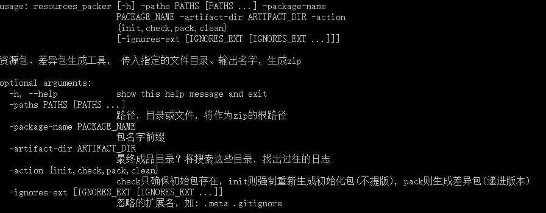

# resources_packer 资源打包工具

resources_packer是一个简单实用的游戏资源更新包制作工具。


## 应用场景

玩游戏的时候经常遇到这样的一个场景，打开游戏，提示正在下载游戏资源更新包。

假设本地游戏版本1.0.0， 提示下载1.0.0-1.zip更新包，那么这个zip包当中，包含的是的1.0.0版本与1.0.1版本差异的文件；

假设本地游戏版本1.0.1， 很久没有玩游戏，提示正在更新1.0.1-10.zip更新包，这个zip包当中，包含了从1.0.1版本到1.0.10版本的所有差异文件。

那么，像1.0.1-10.zip这种差异包，是如何生成？人工挑出差异文件，制作zip包？有没有自动化的方法？

resources_packer就是一个生成版本差异资源包自动化工具。


## Example


你可以同通过命令行获取到详细帮助:



Linux/Unix下：
```shell
resources_packer --help
```

Windows下，需要预先安装Python环境：
```shell
resources_packer.bat --help
```
或
```shell
python resources_packer --help
```

## 打包模式

resources_packer有3种不同的模式，来适应不同的实际情况。

### check检查或创建
常用。检查是否存在当前版本的资源包，不存在则init创建。存在则不做任何事。

假设，当前没有生成任何资源包，则生成0号zip包。
假设，当前已有0号zip包，则不做任何事。

### pack差异打包
核心。生成差异资源包时，提升资源版本号。

假设当前已0号资源包， 执行pack行为，将会识别0号资源包的文件，与当前所有资源文件进行比较。差异的文件，生成1号资源包。


### init初始化

强制重新生成当前版本的差异包。

假设当前资源版本10， 执行init后，重新生成10版本，覆盖之前的10号资源包。

init一般很少手动执行，一般在你不想修改当前资源包版本号，但又想重新添加差异文件的时候使用。
